# Search intent parsing with Jev-style decision models

An experiment in parsing a furniture e-commerce search query into three parts with a **decision model**: a model that answers typed multiple-choice questions with calibrated probabilities instead of generating text (TypeSafe's Jev API and its open counterparts).
Study accuracy and latency (measured on Mac M3 Max GPU), on a synthetic dataset.

For example:
```
query:     cheap grey oak coffee table with storage
category:  Tables > Coffee tables
filters:   color=grey, material=oak, feature=with_storage
residual:  cheap
words:     cheap/R grey/F oak/F coffee/C table/C with/F storage/F      (C category, F filter, R residual)
```

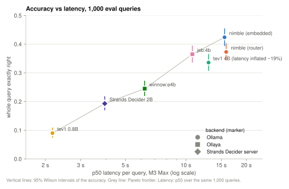

## TL;DR
The main results: 
* TypeSafe's hosted Jev is both the *most accurate* and *the fastest* (~0.3 s, including the network).
* Jev's latency stays flat as questions are added (0.34 s for 1 question, 0.35 s for 29), while every local model gets slower with each question.
* Among local models on the M3 Max, accuracy costs time: nimble reaches 0.42 at ~16 s, and the 4–7× faster models are much less accurate.

## Problem formulation
**Given:**
- **A query** `q = w_1 … w_N`: free text split into N whitespace-separated words, possibly with typos.
- **A category ontology** `T`: a product-type tree, L1 group → L2 type → optional L3 subtype. Here it has 6 L1, 36 L2 and 41 L3 nodes, e.g. Seating > Sofas > Sectional sofa.
- **Attributes** `a ∈ A`, each with a finite value set `V_a`. Here there are 12: color, material, leg material, leg color, style, shape, bed size, width, seat count, firmness, feature and room. Numeric width is bucketed into 5 ranges, e.g. 48–71 in.
- **Applicability:** which attributes make sense for which category (e.g. firmness only for mattresses).

**Predict:**
1. **Category** `c ∈ T ∪ {none}`: the **most specific node the query names**, at any depth. "seating" means the L1 group; "grey sectional" means the L3 node. `none` means the query names no product type, e.g. "minimalist furniture".
2. **Filters** `F ⊆ {(a, v) : a ∈ A, v ∈ V_a}`: the attribute values the query explicitly requests, at most one value per attribute (possibly none).
3. **Word roles** `r_i ∈ {category, filter, residual}` for every word `w_i`.
   - **The residual terms** are the words with role `residual`: words that do not denote category and filters (can probably influence the scoring of search results)
   - **Connecting words** take the role of the phrase they belong to: "**with** storage" and "**under** 30 inch" are filter, "chest **of** drawers" is category, and "**for** my mom" is residual.

**Scoring** (definitions with counts are in `results/results_eval.md`):

| Part | Measure |
|---|---|
| Category | exact-node accuracy (depth must match; `none` is a value), plus accuracy at L1 / L2 / L3 |
| Filters | micro precision / recall / F1 over (attribute, value) pairs, plus filter-set exact match |
| Word roles | accuracy over all words; precision / recall / F1 for `residual` |
| **Whole query** | **exactly right:** category, filter set and the set of residual words all correct |

Two further measures: **latency** per query on local hardware, and paired significance tests between systems.

## Solution idea: answer all questions with a one decision model request
Each query becomes **one Jev-shaped `/v1/systemone` request**. The query is the `state`, and every sub-decision is a named `choice` question about it:
- **Category:** one question per top-level product group, e.g. "which kind of table, if any?". Each lists that group's L2/L3 types, plus "not this group" and "only the general word".
- **Filters:** one question per attribute (color, material, legs, style, size, width, …), each with `not_specified` plus the attribute's values.
- **Word roles:** one question per word of the query ("role of word 3, `oak`?"): `category`, `filter` or `residual`. This gives a token-level tagging, and the words tagged `residual` are the residual terms.

A decision model doesn't generate text. For every question it returns:
- the chosen option;
- a **probability for every option**;
- a **confidence**: one number for how peaked that distribution is. Ollaya, for instance, defines it as (K·p_max − 1)/(K − 1); Ollama doesn't document its definition.

A small decoder turns the **per-option probabilities** into the parse. It doesn't use the confidence. The parse consists of:
- the most probable category;
- filters whose value probability clears a threshold;
- the word roles.

The models themselves are used as they are, with no training or fine-tuning. Only the decoder's few **thresholds and weights are tuned**, on a dev split and per model (see "What tuning means"). Because the whole parse is a single typed request, it is easy to ablate, and every part can be scored separately.

One assumption is that Jev's value comes in parallelization of question answering and thus low latency, so it is interesting to see if other decision models have similar properties of a decoder.

## Goals of the study
1. **Feasibility and accuracy.** Can a decision model parse search intent in one request? How accurate is it per part (category, filters, word roles / residual words) and on the whole query?
2. **Question design.** Does the way the category is asked matter: an explicit top-level "which group?" question, or the group decision embedded in the group questions?
3. **Latency on local hardware** (a MacBook Pro M3 Max, 36 GB): where does the time go, and what would reduce it?
4. **Runtimes and models.** The same request served by:
   - Ollama's `nimble`;
   - nimble's own batched MLX scorer (`ParallelScorer`);
   - other open decision models (Together AI's `tev1`, and Ollaya's encoders and decoders);
   - TypeSafe's hosted Jev (`jev-1.13.0`), as the reference these open models imitate.

## Key findings
- **Best overall: TypeSafe's hosted Jev (`jev-1.13.0`), and it's also the fastest.**
  - 1,000 eval queries: category exact 0.987, filters F1 0.921, word roles 0.854, **whole query exactly right 0.535**, at **0.3 s per query** including the network round trip.
  - It's significantly better than every other run on both the whole query and category (McNemar p ≤ 0.0001). Its only weaker part is residual words (F1 0.695 vs nimble's 0.733): it labels 38% of residual words as filters.
  - Its decoding wasn't changed: tuning on dev kept nimble's settings.
- **Best local: `nimble` (9B) on Ollama with the `embedded` category scheme.**
  - 1,000 eval queries: category exact 0.917, filters F1 0.912, word roles 0.841, **whole query exactly right 0.424**, at ~16 s per query on the M3 Max.
  - It's significantly better on the whole query than every other local run (McNemar p < 0.001), mainly thanks to filters and word roles.
- **Embedding the group decision beats an explicit top-level question:** category 0.917 vs 0.836. The top-level question picked wrong groups confidently.
- **Among local models, others win on parts.**
  - `winnow:e4b` (Ollaya) has the best local category accuracy (0.966; Jev 0.987) and is fast (6 s), but barely finds residual words.
  - `tev1` 4B is also better at category (0.942) and ~30% faster (10.7 s in a clean benchmark), but weaker at filters and word roles.
- **Encoders and small models fail the word-role questions:** their role probabilities are nearly uniform, so they give an effectively constant answer. They can't resolve "role of word N" against the numbered word list in the state.
- **Latency is dominated by one prefill of the whole question set.** A query takes ~16 s with nimble.
  - Every question's text is in one shared prompt (~5.4k tokens), prefilled once at ~500 tok/s (~11 s). Then each question is answered from a ~13-token suffix (~0.18 s each, sequential).
  - nimble's batched MLX `ParallelScorer` is no faster here (17.4 s): batching the suffixes saves little at this prompt length.
  - The real levers are fewer or shorter questions, or a server that puts the static questions before the query, so they could be cached across queries.
  - **AWS's Strands Decider 2B shows the other layout:** it encodes the state once and adds only each question's suffix, at **3.9 s per query**. But its accuracy is much lower (whole query 0.193).
  - **Jev answers the same 24-question request in 0.3 s, and its latency stays flat from 20 to 30 questions** (~0.33 s), while every local model gets slower with each question. That fits the assumption that Jev evaluates questions in parallel. So the slowness is in the local runtimes, not in the one-request design. How Jev works internally isn't published.
- **A forgiving whole-query score tells the same story at the top:** Jev 0.920, nimble 0.880 (weighted partial credit for category, filters and words; see "A forgiving whole-query score"). The middle of the local ranking depends on the weights.
- **The data are synthetic and cleaner than real queries,** so the accuracies are upper bounds.

## First 15 minutes
1. **Set up:** `make setup` installs the Python environment (uv).
2. **Check the machine:** `make doctor` shows which servers, models and keys this machine has, and which of the study's runs it could re-run. Every gap comes with its fix.
3. **See what's stored:** `make runs` lists every run with its stored predictions and decoding settings.
4. **Read the shipped results.** No commands are needed:
   - [`results/results_eval.md`](results/results_eval.md): all metrics on 1,000 eval queries, with counts and confidence intervals;
   - [`results/mcnemar_eval.txt`](results/mcnemar_eval.txt): which runs are significantly better than which;
   - the dev counterparts, `results_dev.md` and `mcnemar_dev.txt`, for all 15 runs;
   - per-run error analysis in `results/report_eval_<run>.md` (per-attribute scores, confusions, worst queries).
5. **Try the parser:** `make ollama-pull MODEL=nimble` (9.5 GB, needs Ollama ≥ 0.35), then `make parse Q="blue velvet sofa for my mom"`.

To re-run models and check the numbers, see "Reproducing the results" below.

## Dataset
Frankly, the synthetic dataset is the biggest weakness of this study. Not really checked by a human.
- **Schema** (`src/sidm/schema.py`):
  - A product-type ontology: 6 L1 groups, 36 L2 and 41 L3 nodes, each with surface synonyms.
  - 12 categorical attributes with surface forms.
  - A residual vocabulary.
  - Import-time checks ensure that no synonym is shared by two nodes, and that residual words don't collide with category or attribute words.
- **Generation** (`src/sidm/gen_dataset.py`, model `qwen3:14b`):
  - Sample a gold intent (category at any depth, 0–3 filters, 0–2 residual phrases, occasional typos).
  - qwen3 writes a natural query and labels **every** word. A connecting word belongs to the filter or category phrase it sits in ("**with** storage", "chest **of** drawers"); otherwise it's residual.
  - Each row is validated: spans cover every word, labels map back to the gold intent, widths fall in their bucket, and residual words contain no category or attribute term. Failures are retried with the error fed back to qwen3.
- **Size and splits:** 1,100 rows in `data/eval_raw.jsonl`.
  - **dev** = ids 0–99, used for all tuning.
  - **eval** = ids 100–1099, 1,000 queries.
- **Review:** `data/REVIEW.md` records the manual review and a few hand fixes. `data/preview.txt` is a readable dump (`make preview`).


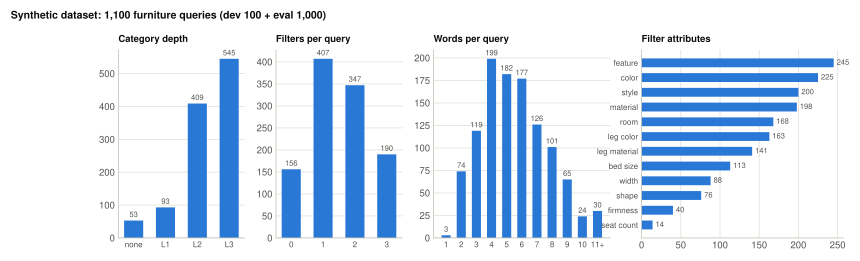

*Most queries name an L2 or L3 product type and 1–2 filters; queries are 4–6 words long typically, up to 11+.*

## Request design
### Request shape
This is the default `embedded` scheme; `router` differs only in the category questions.
```
POST /v1/systemone
{
  "model": "nimble",
  "keep_alive": "30m",                            // Ollama only
  "state": {
    "query":      "<query>",                      // original search query
    "words":      ["1: <w_1>", …, "N: <w_N>"],    // the query split into words
    "word_roles": "<role definitions + connecting-word rule>"
  },
  "questions": {
    // category: one question per L1 group g = 1..G
    "cat_<g>": {
      "type": "choice",
      "instructions": "Is a kind of <g> searched? Which exact product type? 'other_product' if …",
      "criteria": {
        "other_product": "a different kind of product, or no product named",
        "unspecified":   "only a general word for <g> (<synonyms>)",
        "<node_1>": "<Name> (<synonym>, <synonym>)[, type not specified]",
        …                                     // all M_g L2/L3 nodes of group g
      }
    },
    // filters: one question per attribute a = 1..A
    "filter_<a>": {
      "type": "choice",
      "instructions": "<attribute description> requested in the query? 'not_specified' if not mentioned.",
      "criteria": {
        "not_specified": null,
        "<value_1>": "<extra synonyms>" | null,
        …                                     // all V_a values of attribute a
      }
    },
    // word roles: one question per query word i = 1..N
    "word_<i>": {
      "type": "choice",
      "instructions": "Role of word <i> \"<w_i>\"?",
      "criteria": { "category": null, "filter": null, "residual": null }
    }
  }
}
```
- **G** is the number of L1 groups, and **M_g** the number of L2 and L3 nodes in group g. Each L2 is listed before its L3 children, and an L2 that has children is described as "type not specified". `cat_<g>` has **M_g + 2** options.
- **A** is the number of attributes and **V_a** the number of values of attribute a. `filter_<a>` has **V_a + 1** options. Width values are described by their inch range, e.g. "48-71 in".
- **N** is the number of whitespace-separated words, capped so the total stays within the API's 64 questions.
- **Total: G + A + N questions.**
  - Each question must have 2–26 options, so M_g ≤ 24 and V_a ≤ 25.
  - The rendered prompt must fit the model's context: 8,194 tokens for nimble.
  - **In our setup:** G = 6, A = 12 and N = 5–8 for a typical query, giving 23–26 questions and about 13 KB of JSON.
- **The `router` scheme** adds `"cat_L1"`, a choice over the G groups plus `"none"`. Its group questions ask "If <g> is searched, which exact product type is named?" and have **no `other_product`** option (M_g + 1 options). Total: 1 + G + A + N.
- **Response:** for each question, the chosen option, a probability per option and a confidence, plus token usage.
- **Full example:** [`docs/example_request.md`](docs/example_request.md) has a real request for each scheme, nimble's response and the decoded result (`make example-doc`).

### What the model actually sees (nimble)
This is nimble's prompt format, per `prepare_prompts` in [bespokelabsai/nimble](https://github.com/bespokelabsai/nimble). That Ollama renders our questions into it exactly like this is inferred from its server log; see "Latency analysis".
```
system:    Classify the context using the supplied schema. … one-letter codes …
user:      {"context": <state>,
            "schema": [ {"name": "<question key>", "description": "<instructions>",
                         "choices": [ {"code": "A", "value": "<criteria key>", "description": "<criteria text>"}, … ]},
                        … one entry per question … ]}

            Requested field: <question key>
assistant: <one token: the code letter, scored over that question's codes>
```
- **Everything before the question key is shared** by all questions of a request and is prefilled once. Each question then appends only its key and the turn switch.
- **`state` comes before the schema,** so nothing is reused between queries.

### Decoding
The decoder lives in `src/sidm/parser.py`.
- **Category:** the most confident option across the G `cat_<g>` questions, ignoring `other_product`.
  - "No category" is predicted when a signal exceeds the scheme's threshold. For `embedded` the signal is 1 − the best candidate's probability; for `router` it is P(`cat_L1` = none).
- **Filters:** a value counts only above a probability threshold. The values are then masked to the attributes applicable to the predicted category.
- **Word roles:** argmax over the three roles, with the `category` probability up-weighted.
- **Thresholds and weights are tuned per model on dev** (`make tune` → `results/tuned_settings.json`), because models are calibrated very differently. The nimble defaults are: no-category threshold 0.70, filter p ≥ 0.95, `category` weight ×8.
- **Schemes:** the two category schemes are an ablation defined in `CategoryScheme` (`src/sidm/parser.py`). Everything else is shared.

### What tuning means
**No model is trained or fine-tuned.** "Tuning" only sets three parameters of the decoder above:

| Parameter | What it controls | Why it's needed | nimble value |
|---|---|---|---|
| No-category threshold | how strong the "no group claims the query" signal must be before predicting *no category* | the probabilities alone don't separate "none" from a weak match | 0.70 |
| Filter probability threshold | the minimum probability for a filter value to count | without it, models add attributes the query never mentions | 0.95 |
| Word-role `category` weight | a multiplier on the `category` probability before the argmax over the three roles | models under-predict `category` for words | ×8 |

**How the values are chosen** (`make tune`, i.e. `evaluate tune --apply`):
- a small grid search with two passes of coordinate ascent: no-category threshold 0.3–1.0, filter threshold 0–0.98, weight 1–16;
- it maximizes **whole-query exact match on the 100 dev queries**; ties keep the current value;
- it re-decodes the stored raw answers, so no model calls are needed;
- the result is saved per `backend:model` in `results/tuned_settings.json`. Runs without an entry use the backend defaults, which are nimble's values.

**Why per model:** models are calibrated very differently. A threshold that suits nimble can wipe out another model's filters or word roles.

**Effect** (eval, whole query exactly right; plain argmax with `--untuned` vs tuned):

| Run | Untuned | Tuned | Mainly through |
|---|---|---|---|
| nimble, embedded | 0.318 | **0.424** | filters F1 0.830 → 0.912 |
| nimble, router | 0.197 | **0.373** | category 0.626 → 0.836 (group-max instead of top-down), filters |
| jeb:4b | 0.230 | **0.365** | filters F1 0.852 → 0.888 |
| Jev | 0.452 | **0.535** | filters F1 0.892 → 0.921 (nimble's settings; tuning on dev kept them) |

**Eval is never used for tuning.** Dev results are optimistic because dev is the tuning set.

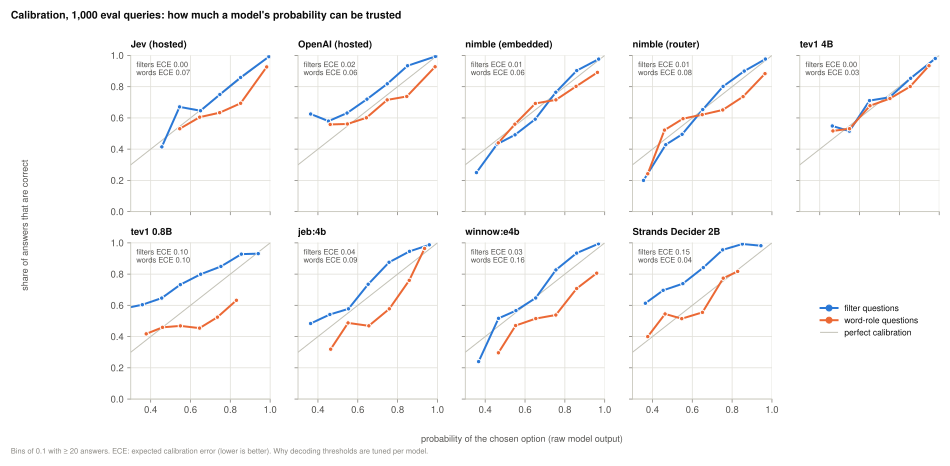

*Why thresholds are tuned per model: models are calibrated very differently. nimble's and tev1 4B's filter probabilities are close to honest (ECE ≤ 0.01). Strands Decider and tev1 0.8B are under-confident on filters (curve above the diagonal), so a high threshold would throw away correct filters. jeb and winnow are over-confident on word roles (curve below the diagonal). Jev's filter probabilities are as honest as nimble's (ECE 0.00), and it's slightly over-confident on word roles (0.07).*

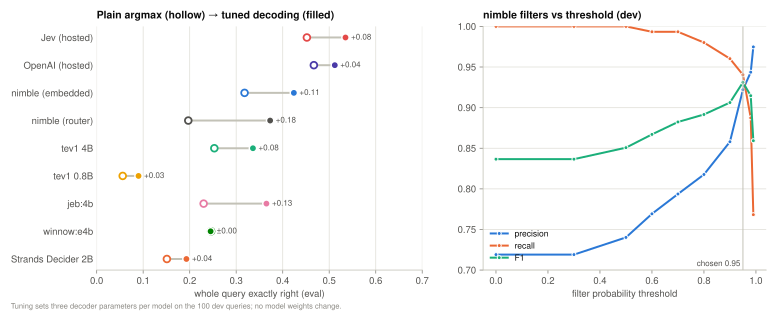

*Left: tuning helps every run except winnow, most of all nimble router (+0.18, from group-max category decoding) and jeb (+0.13); Jev gains +0.08 from nimble's settings. Right: for nimble, the filter threshold trades recall for precision; F1 peaks near the chosen 0.95.*

## Backends and models
The same request can be served by five ablatable backends (`--backend`). A run is named `<scheme>@<backend>:<model>`, e.g. `embedded@ollaya:jeb:4b`.

| Backend | Server | How a request is scored |
|---|---|---|
| `ollama` (default) | Ollama 0.35, `localhost:11434` | one prefill of the whole question set, then **one question at a time**. Requests that exceed a model's context are split automatically (tev1) |
| `mlx` | `mlx_backend/server.py` (nimble's `ParallelScorer`), `localhost:11500` | one prefill, then fields batched (`--mode parallel`) or one at a time (`--mode cached_serial`) |
| `ollaya` | [Ollaya](https://github.com/ollaya-dev/ollaya) 0.9, `localhost:11435` | per model family: most score all questions in one batched pass; `winnow` shares the state prefix and runs questions sequentially |
| `decider` | [Strands Decider](https://github.com/strands-labs/strands-decider)'s own server (`decider_backend/serve.sh`), `localhost:11600` | **the state is encoded once, then only each question's short suffix is added**, batched up to 32 per pass |
| `jev` | TypeSafe's hosted API, `https://api.typesafe.ai` | hosted Jev, needs `TYPESAFE_API_KEY` |

### Models tested
| Model | Backend | Type, size, precision | Evaluated on |
|---|---|---|---|
| `nimble` (Bespoke Labs) | ollama | Qwen3.5-9B LoRA, GGUF | dev + eval, both schemes |
| `nimble` (Bespoke Labs) | mlx | the same adapter merged and converted by us: 8-bit MLX, `lm_head` in bf16 | dev |
| `tev1` (Together AI) | ollama | Qwen3.5-4B fine-tune | dev + eval |
| `tev1:0.8b` (Together AI) | ollama | Qwen3.5-0.8B fine-tune | dev + eval |
| `jeb:4b` | ollaya | Qwen3.5-4B, merged LoRA, GGUF Q8, llama.cpp Metal | dev + eval |
| `winnow:e4b` | ollaya | Gemma 4 E4B fine-tune, GGUF Q8, llama.cpp Metal | dev + eval |
| `decider:2b` | ollaya | Qwen3.5-2B decoder, ONNX on the CPU | dev |
| `decision:eos` | ollaya | Qwen3.5-0.8B with an endpoint head, ONNX on the CPU | dev |
| `kev:0.8b` | ollaya | Qwen3.5-0.8B LoRA with a pointer head, ONNX on the CPU | dev |
| `laya:en` | ollaya | ModernBERT-large encoder (421M), MLX | dev |
| `laya:typed-decisions` | ollaya | ModernBERT-large fine-tune, ONNX on the CPU | dev |
| `von` | ollaya | ModernBERT-large encoder (395M), ONNX on the CPU | dev |
| `nli:modernbert-large` | ollaya | NLI cross-encoder, one pair per option | dev |
| `strands-decider-2b` (AWS Strands Labs) | decider | Qwen3.5-2B-Base, LoRA + pointer head, MLX (`StrandsAgents/strands-decider-2B-hobson-v19`) | dev + eval |
| `jev-latest` (TypeSafe), served as `jev-1.13.0` | jev | hosted API; architecture not published | dev + eval |

**Not tested:**
- **Too few options for our 24-option questions:** Ollaya's `jevk5` (≤ 16 options), `cygnet` (≤ 20) and `decider:2b-vision` (≤ 10).
- **Too slow here:** the ~18 GB CPU-only models `nimble`, `jeeves`, `clef`, `clm` and `kev:9b`.
- **Built-in questions only:** `qwen3guard`.

### nimble's MLX `ParallelScorer` (`mlx` backend)
It runs in a separate Python 3.12 environment in `mlx_backend/`. Model files go under `$SIDM_MODELS_DIR` (default `~/sidm-models`).
```bash
make mlx-convert        # once: download the adapter + Qwen3.5-9B, merge, quantize to 8-bit MLX (lm_head kept bf16), verify
make mlx-serve          # unloads Ollama's nimble (memory), serves on :11500
make parse BACKEND=mlx
```
- **The server:** it converts each question into nimble's schema (key → field name, `instructions` → description, criteria → choices) and returns Ollama-shaped answers plus nimble's own timings (`prefill_seconds`, `field_evaluation_seconds`).
- **`convert_model.py` is reusable:** it takes `--repo`/`--revision` (e.g. `bespokelabs/Bespoke-Nimble-9B-v2`), `--q-bits 4|8|none`, `--models-dir`, `--name` and `--keep-intermediate`.
  - Its stages (`download`, `merge`, `quantize`, `verify`, `config`) can each run on their own, and an interrupted run resumes.
  - Peak disk use is ~2× the base model (~40 GB for nimble 9B), with ~10.5 GB left at the end.

### Other models on Ollama (tev1)
`make ollama-pull MODEL=tev1`, then `make parse MODEL=tev1`.
- **Ollama renders tev1 like nimble,** with one shared prompt holding every question (~5.4k tokens). But tev1's context is ~2k tokens.
- **The client splits the request automatically.** The server answers `prompt has N tokens; expected 1–M`, so the client cuts the questions into balanced chunks that fit and merges the answers: 6–7 requests per query for tev1 on dev. In the eval runs the client kept the largest split it had needed (11) for all later queries, so most eval queries went out as 8–11 requests; this costs ~3% latency (measured in the sweep below) and is fixed for new runs.
  - The chunk count is learned once per model.
  - Each prediction records `n_requests`, and latency is the sum of the requests.

### Ollaya
Installed user-locally, with models under `~/sidm-models/ollaya-models`:
```bash
OLLAYA_INSTALL_DIR=$HOME/sidm-models/ollaya OLLAYA_NO_SERVICE=1 sh install.sh   # install.sh from ollaya.dev
make ollaya-serve                          # unloads Ollama's models, serves on :11435
make ollaya-pull MODEL=jeb:4b
make parse BACKEND=ollaya MODEL=jeb:4b
```

### Strands Decider (AWS Strands Labs)
A 2B decision model released Oct 2026. It runs in its own Python 3.12 environment, `decider_backend/`, installed from its GitHub repo at a pinned commit, because the PyPI release (0.1.0) lacks the MLX device and `--strict-window`.
```bash
make decider-setup      # once: uv sync of decider_backend/
make decider-serve      # unloads Ollama/Ollaya; first start downloads ~4 GB (LoRA + head + Qwen3.5-2B-Base) into ~/sidm-models/hf-home
make parse BACKEND=decider
```
- **Its engine evaluates questions differently from nimble on Ollama.** It encodes the state once, keeps that cache, and forwards only each question's own tokens, batched (up to 32 per pass). Question texts are *not* re-read for every query in one shared prompt, which is what dominates nimble's latency on Ollama (see "Latency analysis").
- **Options:** our 24-option questions are accepted.
- **Window:** the server runs with `--strict-window`, so a prompt longer than its window is refused rather than silently cut. Our requests fit.

### Jev (TypeSafe hosted)
Needs an API key. Put it in `.env` at the repo root, which git ignores and every `sidm` command reads:
```bash
cp .env.example .env                              # then set TYPESAFE_API_KEY=... in .env
make doctor                                       # shows "TYPESAFE_API_KEY set (from .env)"
make parse BACKEND=jev
make dev BACKEND=jev LIMIT=5                      # paid API: try a few rows first
make dev BACKEND=jev && make tune BACKEND=jev && make eval BACKEND=jev
```
- **Key:** sent as `Authorization: Bearer …`. A variable already set in the environment (`export TYPESAFE_API_KEY=…`) takes precedence over `.env`.
- **Requests:** the same body as Ollama's, minus `keep_alive`.
- **Retries:** HTTP 429 and 5xx are retried with backoff.
- **Model:** `jev-latest` moves with releases, so each prediction records the versioned model that answered (`served_model`). Pin a version with `MODEL=jev-1.13.0`.

**Run only one model on the GPU at a time.** Memory is tight with 36 GB; `make status` shows what's loaded where.

## Results
- **Full tables:** [`results/results_eval.md`](results/results_eval.md) (1,000 eval queries) and [`results/results_dev.md`](results/results_dev.md) (all runs on the 100 dev queries).
  - Each metric comes with its definition, counts and a 95% Wilson interval.
  - McNemar tests are given against the first run and for all pairs.
- **Machine-readable:** `results/results_eval.json` and `results/results_dev.json`, with per run its settings, every metric with counts and intervals, per-attribute filter scores, the word-role confusion matrix, latency, and all pairwise tests.
- **Per-query predictions with raw answers:** `results/<split>_<label>_<scheme>.jsonl`.
- **Readable significance tests:** `results/mcnemar_eval.txt` and `results/mcnemar_dev.txt`, every pair of runs with the winner or "no significant difference".
- **Detailed per-run reports:** `results/report_eval_<run>.md`, one per eval run, e.g. [`report_eval_nimble_embedded.md`](results/report_eval_nimble_embedded.md). Each has per-attribute filter scores, the word-role confusion matrix, the top category confusions and the 20 worst queries with gold vs predicted parse.
- **Figures:** `docs/figures/*.svg`, drawn from the shipped files by `make figures` (`src/sidm/figures.py`; also part of `make results`).

### Eval: 1,000 queries (decoding tuned per model on dev)
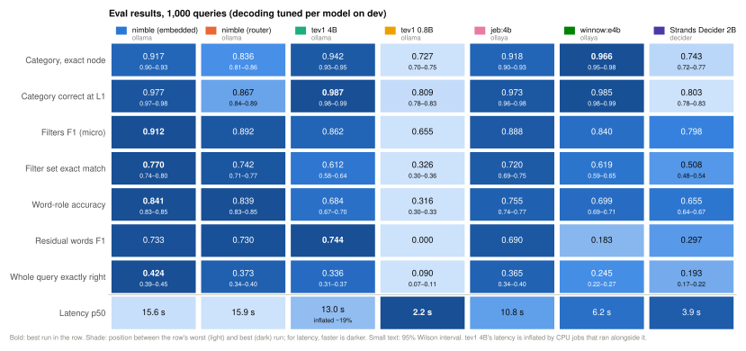

*Exact numbers with counts and definitions: [`results/results_eval.md`](results/results_eval.md). Bold marks the best run in each row; darker cells are closer to the row's best (for latency, faster). Jev leads every row except residual words, where tev1 4B and both nimble runs score higher. Among local runs, nimble embedded leads on filters, word roles and the whole query; winnow and tev1 4B on category; tev1 0.8B and Strands Decider on speed.*

- **Low "whole query exactly right" scores are expected, for every model.** It's the strictest possible measure: one query counts only if the category node, the whole filter set and the role of every single word are all right.
  - **Errors compound across the parts.** nimble embedded gets the category right on 0.917 of the queries, the filter set on 0.770, and every residual word on 0.527. Jev gets 0.987, 0.800 and 0.651. Multiplied, that's 0.37 and 0.51, close to their whole-query scores of 0.424 and 0.535 (errors are somewhat correlated, so the real score is a bit higher than the product).
  - **The word roles are the bottleneck.** A 7-word query needs 7 roles right, and the boundary between filter, category and residual words follows the dataset's labeling convention (e.g. "furniture" is residual, "with" in "with storage" belongs to the filter). The models are used as they are, never trained on that convention.
  - **So compare runs with each other, and per part,** rather than reading whole-query accuracy as "how often the parse is usable". A search engine would act on the category and filters, which are right far more often.
- **Latency** is the p50 over the same 1,000 queries, one request at a time. tev1 4B's eval ran alongside CPU jobs: at the same question count it is ~19% slower than in a 30-query benchmark with nothing else running (`make bench`: 10.7 s), so its 13.0 s is labeled inflated. jeb's and winnow's evals overlapped too, but match their benchmarks within 1%.
- **tev1 0.8B is the fastest local decoder (2.2 s) but far behind:** whole query 0.090, with near-uniform word roles and no residual words found.
- **Strands Decider 2B is ~4× faster than nimble (3.9 s vs 15.6 s) but much less accurate** (whole query 0.193).
  - Its engine encodes the state once and adds only each question's suffix, so it avoids re-reading all question texts per query.
  - It's weaker on category (0.743; e.g. "coffee table" vs "desk") and on residual words.
  - Every model except tev1 0.8B beats it on the whole query (p ≤ 0.0002); it beats tev1 0.8B (141 vs 38 queries).
- **Jev is best on the whole query and on category.** Against nimble embedded: 215 queries only Jev got right vs 104 only nimble got right (whole query), and 74 vs 4 (category); p < 0.0001. Against winnow, the best local model on category: 25 vs 4 (p = 0.0001).
- **Jev's weak part is residual words** (F1 0.695, below tev1 4B's 0.744 and nimble's 0.733): it labels 38% of the residual words as filters, against 14% for nimble.
- **Jev's latency isn't comparable to the local runs:** it's a hosted API on unknown hardware, measured from this Mac including the network round trip.
- **nimble with the `embedded` scheme is the best local run on the whole query.** Every other local run is significantly worse (McNemar p < 0.001).
- **On category, winnow:e4b and tev1 4B are significantly better than nimble** (p < 0.0001 and p = 0.002). jeb:4b ties nimble on category (p = 1.0).
- **jeb:4b beats tev1 4B on the whole query** (116 vs 87 queries, p = 0.049), but tev1 is better at category.
- **A local hybrid could combine the strengths:** category from winnow or tev1, filters and word roles from nimble. Not tried yet; neither is Jev combined with a local model's residual words.


*Locally, accuracy grows steadily with latency. The Pareto frontier of the local runs goes tev1 0.8B → Strands Decider → winnow → jeb → nimble embedded; tev1 4B and nimble router are dominated. The hosted Jev sits above and to the left of all of them.*

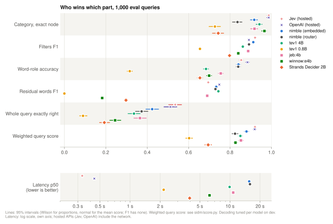

*Jev leads on every part except residual words, where tev1 4B and nimble are ahead. Among local models none wins every part: winnow and tev1 4B lead on category, nimble on filters, word roles and the whole query. Residual words separate the models most: from 0 (tev1 0.8B) to 0.74 (tev1 4B). The last accuracy row is the weighted query score (see "A forgiving whole-query score"): the same order at the top, with the local models much closer together. The bottom panel adds each run's p50 latency on its own log axis.*

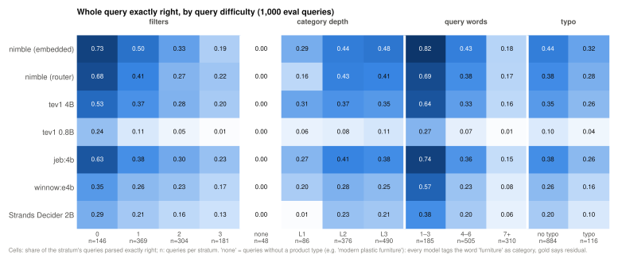

*The whole query gets much harder with more filters (nimble: 0.73 with none, 0.19 with three) and more words (0.82 for 1–3 words, 0.18 for 7+). Jev degrades much less (0.68 → 0.41 with filters, 0.82 → 0.31 with words); that's where its lead comes from. Typos cost the local models ~0.1, and Jev 0.21 (0.56 → 0.35). Queries that name only an L1 group are harder than specific ones. No run gets a query without a product type right: models tag the word "furniture" as category, while the gold labels make it residual (a labeling convention worth revisiting, see `backlog.md`).*

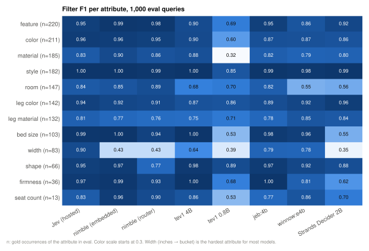

*Width (inches mapped to a bucket) is nimble's weakest attribute (0.43); Jev handles it best (0.90), and among local models jeb and winnow do much better than nimble (0.79, 0.78). Room is weak for winnow and Strands Decider. A hybrid could take each attribute from the model best at it.*

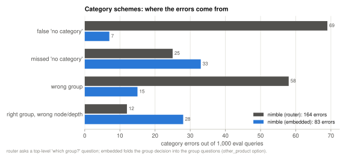

*The `embedded` scheme halves nimble's category errors (83 vs 164). An explicit top-level question mostly fails by picking "no category" or the wrong group; with `embedded`, the remaining errors are mainly the wrong node within the right group.*

### A forgiving whole-query score
"Whole query exactly right" fails a query on one wrong word role. The **weighted query score** gives partial credit instead, so a near miss counts more than a useless parse. It's reported next to exact match, never instead of it. Defined in `src/sidm/score.py`.

**Per query, four parts, each in [0, 1]:**

| Part | Weight | Value | Why |
|---|---|---|---|
| Category | 0.45 | 1 if exact; else the shared path / the deeper path (gold `seating > sofas > chesterfield`, predicted `sofas` → 2/3; same group only → 1/3; another group → 0). "No category" is right only against "no category". | the most important part; the right branch at the wrong depth is a near miss |
| Filters | 0.30 | **F0.5** over attribute=value pairs: precision weighted 4× recall | a wrong filter hides correct results, a missing one only adds some. 1 of 2 filters found → 0.83; both found plus one wrong extra → 0.71 |
| Residual words | 0.17 | **F2** over the residual word positions: recall weighted 4× precision | missing a residual word ("cheap", "free shipping") loses intent; an extra one costs less |
| Other word roles | 0.08 | accuracy over the words whose gold role is category or filter | the least important |

- **Only the parts a query involves count.** A part is present when the gold or the prediction has it. The score is the weighted mean over the present parts: `Σ wₖ·vₖ / Σ wₖ`.
  - So an absent part gives no free points: a query with only a category scores **1.0** if the category is right, and **0.15** if it's wrong (with its word roles right).
  - A hallucinated filter or residual word still costs: it makes that part present, with value 0.
- **Statistics:** the mean over the 1,000 queries with a 95% interval; between runs, a paired sign-flip test on the per-query scores, the counterpart of McNemar's test for a score (all pairs in "How runs are compared").
- **The weights are a judgment call,** so the ranking's dependence on them is reported: each run's rank over 300 random weight vectors that keep the order category ≥ filters ≥ residual words ≥ other word roles.

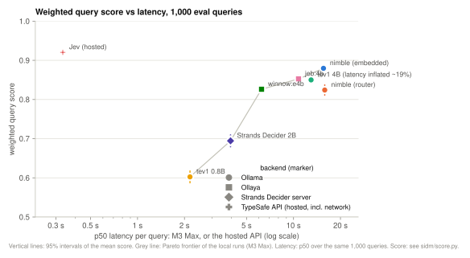

*The counterpart of "Accuracy vs latency". The same picture: Jev on top at 0.920, then nimble embedded (0.880) as the best local run. The gaps between the local models are much smaller than on exact match, because most of their parses are near misses rather than failures.*

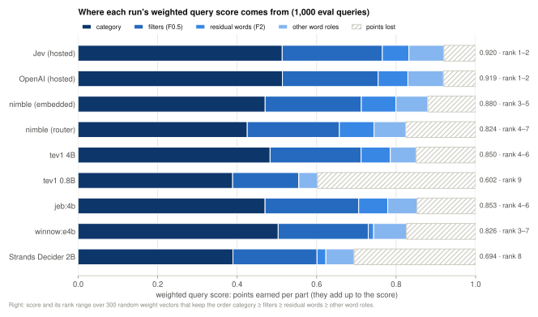

*Points earned per part, adding up to the score. Category earns most of every run's points. winnow and Strands Decider lose most on residual words, tev1 0.8B on everything but category. The rank ranges on the right show the robust ends (Jev 1st, Strands Decider 7th, tev1 0.8B 8th in every weighting) and a weight-dependent middle: winnow ranks anywhere from 2nd to 6th.*

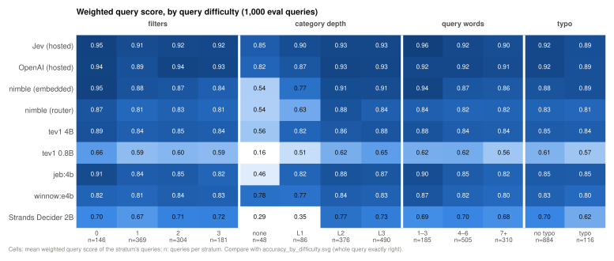

*The counterpart of "by query difficulty". With partial credit, more filters and longer queries cost far less than on exact match (nimble: 0.95 with no filter, 0.84 with three). Queries without a product type score 0 on exact match for every run, but get partial credit here (Jev 0.85, winnow 0.78, nimble 0.54).*

### Dev: all runs (100 queries)
Ranked by whole-query exact match. Latency is from clean runs.

| Model | Backend | Whole query | Category | p50 latency (M3 Max) |
|---|---|---|---|---|
| Jev (`jev-1.13.0`) | jev (hosted) | 0.57 | 0.97 | 0.3 s (hosted, incl. network) |
| nimble (embedded) | ollama | 0.44 | 0.91 | 16.1 s |
| nimble (embedded) | mlx | 0.43 | 0.92 | 17.4 s |
| tev1 4B | ollama | 0.42 | 0.91 | 10.2 s |
| jeb:4b | ollaya | 0.37 | 0.90 | 11.0 s |
| nimble (router) | ollama | 0.35 | 0.85 | 15.4 s |
| winnow:e4b | ollaya | 0.29 | 0.96 | 6.0 s |
| decider:2b | ollaya (CPU) | 0.24 | 0.82 | 46.7 s |
| Strands Decider 2B | decider (MLX) | 0.22 | 0.76 | 3.9 s |
| decision:eos | ollaya (CPU) | 0.11 | 0.76 | 25.8 s |
| kev:0.8b | ollaya (CPU) | 0.11 | 0.76 | 20.0 s |
| tev1 0.8B | ollama | 0.10 | 0.75 | 2.2 s |
| laya:en | ollaya (MLX encoder) | 0.10 | 0.76 | 1.1 s |
| laya:typed-decisions | ollaya (CPU encoder) | 0.06 | 0.73 | 14.6 s |
| von | ollaya (CPU encoder) | 0.06 | 0.55 | 13.0 s |
| nli:modernbert-large | ollaya (encoder) | 0.04 | 0.54 | 5.7 s |

- **Dev is the tuning set,** so these numbers are optimistic.
- **The encoders and small decoders answer word-role questions almost uniformly** (word accuracy ≈ 0.33, residual F1 = 0), and they are weak on filters.
- **Models scoring at least 0.24 on dev got the 1,000-query eval,** plus tev1 0.8B as the fastest local decoder, Strands Decider as a newly released model, and Jev as the hosted reference.


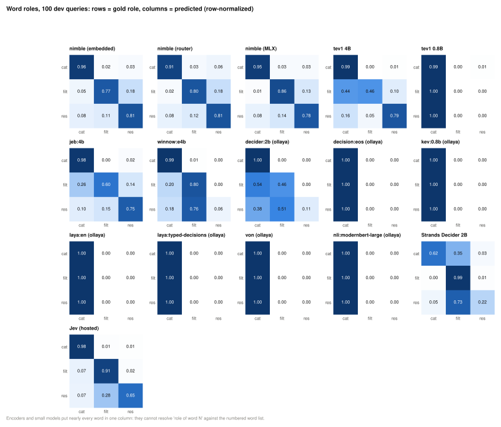

*The encoders and small decoders answer every word-role question with the same role (one dark column). winnow and Strands Decider label most residual words as filters, which is why their residual F1 is low. Jev does so too, less often (28% of residual words on dev, vs 76% for winnow and 11% for nimble).*

### Head-to-head model comparison: McNemar's test
McNemar's test checks whether **two runs scored on the same queries** really differ in accuracy, or whether the difference could be chance.

1. **Score each query right or wrong for both runs.**

   | | B right | B wrong |
   |---|---|---|
   | **A right** | both right | **only A right** |
   | **A wrong** | **only B right** | both wrong |

2. **Ignore queries where both runs agree.**
3. **Test the disagreements.** If A and B were equally good, each disagreement would be equally likely to favor either side, like a fair coin. We use the exact two-sided binomial test on the disagreements (`mcnemar_p` in `src/sidm/results_table.py`).

**What *p* means:** the probability of a split at least as lopsided as the observed one, *if the two runs were really equally accurate*.
- **p < 0.05** means the difference is significant, and the run with more "only me right" queries is better.
- **A large p** means this test can't tell the runs apart. It doesn't prove they are equal.
- **Caveats:** p doesn't measure *how big* a difference is. And with many pairs tested, about 1 in 20 truly-equal pairs will show p < 0.05 by chance.

**Why not just compare accuracies with their confidence intervals?** All runs answer the same queries, and their errors are correlated (some queries are hard for every model). McNemar uses that pairing directly.

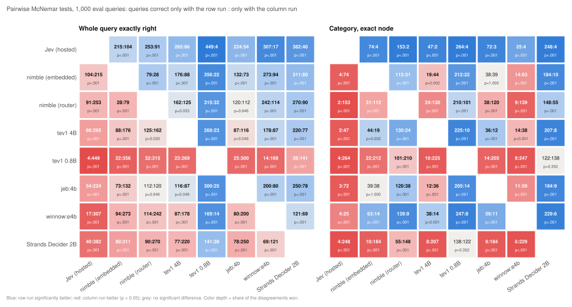

*Each cell is "queries only the row run got right : only the column run got right" with its p-value. Jev's row is all blue on both metrics: it is significantly better than every other run. Among the local runs, nimble embedded's row is all blue on the whole query, and winnow's nearly all blue on category.*

**The weighted query score** is compared with a paired sign-flip test on the per-query scores instead: McNemar needs right/wrong per query, the score is continuous. Under "no difference", each query's score difference is equally likely to have either sign; the p-value is the chance of a total difference at least as large as observed.

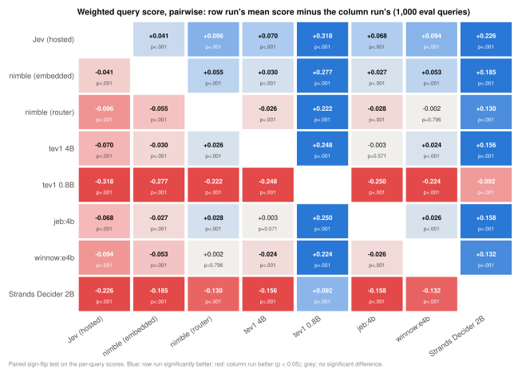

*Row run's mean score minus the column run's, with the paired test's p-value. Jev is significantly ahead of every run. Two pairs that differ significantly on exact match tie on the score: nimble router vs winnow (−0.002, p = 0.80) and tev1 4B vs jeb (−0.003, p = 0.57).*

**Where to find the tests:**
- The tables test every run against the first one, then show all-pairs matrices for category and whole-query exact match. Each cell is "only row right : only column right", with the p-value, and is bold when p < 0.05.
- The JSON files list every pair in `paired_mcnemar`.
- To print them as readable lines, with the winner or "no significant difference":
  ```bash
  make mcnemar                          # dev runs (SPLIT=dev is the default)
  make mcnemar SPLIT=eval               # eval runs
  make mcnemar SPLIT=eval METRIC=full   # only whole-query exact match (METRIC=category for category)
  make mcnemar SPLIT=dev SIG=1          # only significant differences (p < 0.05)
  make mcnemar SPLIT=eval METRIC=score  # the weighted query score's paired sign-flip tests
  ```
- **The weighted query score** has its own all-pairs matrix in the tables and `paired_score_tests` in the JSON (see "A forgiving whole-query score").

## Reproducing the results
### What's shipped and what isn't
- **In the repo:**
  - the dataset (`data/eval_raw.jsonl`);
  - every run's predictions with the models' raw answers (`results/<split>_<label>_<scheme>.jsonl`);
  - the per-model decoding settings (`results/tuned_settings.json`);
  - the tables and tests.
- **Not in the repo:** models, servers and API keys. `make doctor` reports what this machine has and how to get the rest.
- **The dataset is frozen.** Regenerating it with qwen3 (`make data`) isn't deterministic, and it would lose the hand-fixed rows. Use `make data` only to build a *new* dataset.

### How re-running works
- **Runs resume.** `make dev` / `make eval` skip queries that already have stored predictions. With the shipped files complete, `make eval MODEL=tev1` only rebuilds that run's table and says "all rows already done".
- **To re-run a run from scratch, add `OVERWRITE=1`.** It deletes that run's stored predictions for the split and queries the model again; the tables then use the new answers.
  - With `LIMIT=N`, only N queries are re-run. The tables then cover just those N queries for that run until it's complete again.
- **Decoding is re-applied on every table build,** so a re-run is decoded with the shipped tuned settings, unless you re-tune with `make tune`.

### Steps
1. **Pick runs this machine can serve.** `make doctor` lists them; pull or start what's missing.
2. **Re-run a run:**
   ```bash
   make dev  BACKEND=ollama MODEL=tev1 OVERWRITE=1      # 100 dev queries
   make tune BACKEND=ollama MODEL=tev1                  # optional: re-tune decoding on the new dev answers
   make eval BACKEND=ollama MODEL=tev1 OVERWRITE=1      # 1,000 eval queries
   make results                                         # rebuild the tables, mcnemar_*.txt and the per-run reports
   ```
   Then compare with the numbers above.
   - Re-running tev1 0.8B's dev split this way reproduced its metrics exactly: category 0.750, whole query 0.100.
3. **Recalculate the significance tests:** `make results` rewrites `results/mcnemar_*.txt`. `make mcnemar SPLIT=eval [METRIC=full|category] [SIG=1]` prints them, optionally filtered.
4. **Add a new run:** `make dev` → `make tune` → `make eval` with the new `BACKEND`/`MODEL`, then add it to `EVAL_RUNS` / `DEV_RUNS` in `src/sidm/runs.py`, then `make results`.

**Time and space per run**, from the measured p50 latency on an M3 Max with one model loaded; dev takes a tenth of eval:

| Run | Model size | Eval time (1,000 queries) on M3 Max|
|---|---|---|
| `embedded@ollama:nimble`, `router@ollama:nimble` | 9.5 GB | ~4.3 h each |
| `embedded@mlx:nimble` (dev only so far) | 10.5 GB after `make mlx-convert` (~40 GB peak) | ~4.8 h |
| `embedded@ollama:tev1` | 4.5 GB | ~3 h |
| `embedded@ollama:tev1:0.8b` | 0.8 GB | ~40 min |
| `embedded@decider:strands-decider-2b` | 4.3 GB (downloaded on first `make decider-serve`) | ~1.1 h |
| `embedded@ollaya:jeb:4b` | 4.5 GB | ~3 h |
| `embedded@ollaya:winnow:e4b` | 8 GB | ~1.7 h |
| Ollaya CPU models (dev only) | 0.8–3.6 GB | 20–47 s per query |

**Caveats:**
- **Latencies depend on the hardware.** Other Ollama or Ollaya versions, or other quantizations, can change answers slightly.
- **Run one model on the GPU at a time** (`make status` shows what's loaded).
- **Keep the Mac awake** during long runs.
- **Jev needs `TYPESAFE_API_KEY` and is a paid API.** Start with `LIMIT=5`.

## Latency analysis
- **All models were timed end to end:** p50 latencies are in "Results". Two figures below show latency vs request size: as it varies naturally over the eval queries, and in a controlled sweep over the number of questions.
- **Only `nimble` was analyzed step by step:** on Ollama from its llama.cpp server log, and on MLX from nimble's own `ParallelScorer` timings. Every subsection below that is marked "(nimble)" covers nimble only.
  - **tev1 should behave much the same:** Ollama renders it with the same shared prompt, split into several requests because of its 2k context.
  - **Strands Decider is compared only by its source code and total time** (the timeline and layout diagrams below). Its server's steps weren't timed.
  - **Ollaya's models weren't analyzed;** their engines (ONNX, MLX, llama.cpp) score questions differently.

### All models: latency vs request size
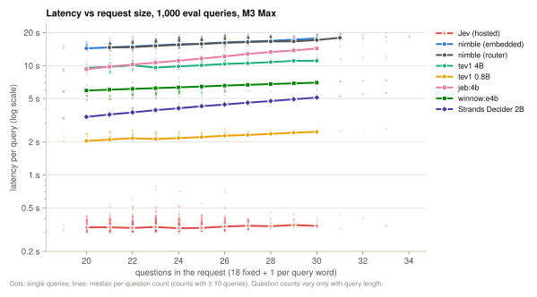

*Over the eval queries, every model gets slower with each extra question, i.e. each extra query word. nimble goes from ~14 s at 20 questions to ~18 s at 31; Strands Decider from 3.4 s to 5.1 s. Jev's line is flat (~0.33 s from 20 to 30 questions, network included). The question count here varies only with query length (19–34).*

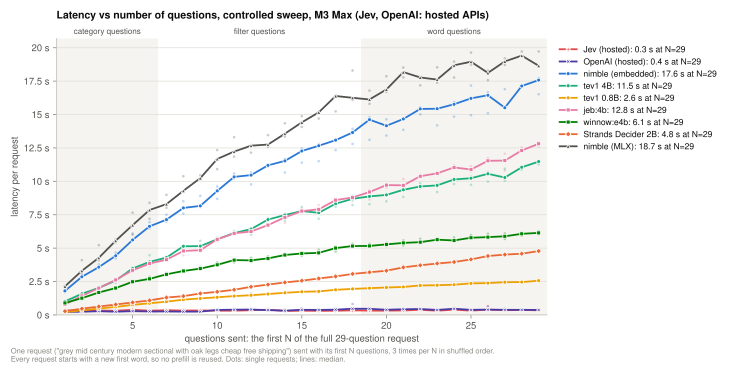

*The controlled sweep (`make sweep`, `src/sidm/bench.py`): one 29-question request sent with only its first N questions, N = 1…29, three times each in shuffled order, one model at a time with nothing else running (Jev: the hosted API, measured from this Mac). Raw data: `results/bench/sweep_<model>.jsonl`.*

What one more question costs, by question type (least-squares slope of the medians over each block):

| Model | 1 question | per category question (1–6) | per filter question (7–18) | per word question (19–29) | all 29 |
|---|---|---|---|---|---|
| nimble (Ollama) | 1.80 s | 951 ms | 595 ms | 304 ms | 17.6 s |
| nimble (MLX) | 2.14 s | 1,146 ms | 721 ms | 262 ms | 18.7 s |
| tev1 4B | 1.02 s | 601 ms | 390 ms | 237 ms | 11.5 s |
| tev1 0.8B | 0.21 s | 134 ms | 86 ms | 55 ms | 2.6 s |
| jeb:4b | 0.78 s | 620 ms | 424 ms | 336 ms | 12.8 s |
| winnow:e4b | 0.90 s | 372 ms | 192 ms | 92 ms | 6.1 s |
| Strands Decider 2B | 0.28 s | 160 ms | 164 ms | 159 ms | 4.8 s |
| Jev (hosted, incl. network) | 0.34 s | ~0 ms | ~0 ms | ~0 ms | 0.35 s |

- **For every model except Strands Decider, a question costs roughly in proportion to its text.** Category questions carry long option lists (up to 24 product types each) and cost 2–4× a word question, whose options are just three roles. That fits the shared-prompt layout: all question texts are prefilled for every query.
- **Jev's latency doesn't depend on the number of questions at all:** 0.34 s for 1 question, 0.35 s for 29, with slopes within ±5 ms per question, i.e. noise. Its questions are evaluated in parallel, or at a cost hidden by the network round trip.
- **Strands Decider pays a flat ~160 ms per question, whatever the text length.** Its engine forwards each question as its own suffix, so the cost tracks the number of questions, not the total text.
- **For latency, cut questions with long option lists first.** For nimble on Ollama, one category question costs about as much as three word questions.
- **Prefill reuse must be ruled out when measuring this.** Ollama's llama.cpp runner keeps up to ~8 GB of earlier prompts in RAM (`cache state: N prompts` in `server.log`) and resumes from the best-matching one, not just the previous one. A first sweep that reused 11 first words in rotation let requests skip up to ~70% of their prefill. The sweep therefore gives every request a never-repeated first word.

### Where the time goes: analyzing Ollama's server log (nimble)
Below is one nimble request from `~/.ollama/logs/server.log`: an embedded eval query (id 264, "storage furniture with glass doors chrome legs", 25 questions, 16.83 s wall time). Lines are trimmed, and `…` marks omitted lines.
The request ran as **26 server tasks: one prefill task plus one task per question**.

```
slot get_availabl: id  0 | task -1    |  - checking sim = 0.016 (86/5450) > 0.100
slot launch_slot_: id  0 | task -1    | sampler chain: logits -> ?penalties -> ?dry -> … -> top-p -> min-p -> ?xtc -> temp-ext -> dist     ← task 1: ordinary sampler
slot   operator(): id  0 | task 35089 | new prompt, n_ctx_slot = 8448, n_keep = 4, task.n_tokens = 5450
slot   operator(): id  0 | task 35089 | forcing full prompt re-processing due to lack of cache data (likely due to SWA or hybrid/recurrent memory …)
slot print_timing: id  0 | task 35089 | prompt processing, n_tokens =   3072, progress = 0.56, t =   3.98 s / 772.76 tokens per second
slot print_timing: id  0 | task 35089 | prompt processing, n_tokens =   4426, progress = 0.81, t =   8.02 s / 551.94 tokens per second
slot print_timing: id  0 | task 35089 | prompt processing, n_tokens =   5446, progress = 1.00, t =   8.74 s / 623.12 tokens per second
slot create_check: id  0 | task 35089 | created context checkpoint 2 of 32 (pos_min = 5445, pos_max = 5445, n_tokens = 5446, size = 50.251 MiB)
slot print_timing: id  0 | task 35089 | prompt eval time =   10843.61 ms /  5450 tokens (    1.99 ms per token,   502.60 tokens per second)
slot      release: id  0 | task 35089 | stop processing: n_tokens = 5450, truncated = 0
slot get_availabl: id  0 | task -1    |  - checking sim = 0.998 (5450/5459) > 0.100     ← question 1: task 1's prompt is a prefix of it
slot launch_slot_: id  0 | task -1    | sampler chain: logits -> logit-bias -> top-k -> ?temp-ext -> dist          ← tasks 2–26: constrained answer
slot   operator(): id  0 | task 35097 | new prompt, n_ctx_slot = 8448, n_keep = 4, task.n_tokens = 5459
slot print_timing: id  0 | task 35097 | prompt eval time =     147.10 ms /     9 tokens (   16.34 ms per token,    61.18 tokens per second)
slot      release: id  0 | task 35097 | stop processing: n_tokens = 5459, truncated = 0
slot get_availabl: id  0 | task -1    |  - checking sim = 0.998 (5447/5458) > 0.100     ← question 2: shares only 5447 tokens
slot   operator(): id  0 | task 35100 | new prompt, n_ctx_slot = 8448, n_keep = 4, task.n_tokens = 5458
slot   operator(): id  0 | task 35100 | restored context checkpoint (pos_min = 5445, pos_max = 5445, n_tokens = 5446, n_past = 5446, size = 50.251 MiB)
slot print_timing: id  0 | task 35100 | prompt eval time =     185.31 ms /    12 tokens (   15.44 ms per token,    64.76 tokens per second)
slot      release: id  0 | task 35100 | stop processing: n_tokens = 5458, truncated = 0
…                                       (23 more tasks like 35100, for questions 3–25)
[GIN] 2026/09/30 - 20:37:03 | 200 | 16.832918125s | 127.0.0.1 | POST "/v1/systemone"
```

| Step | Tasks | Time | Share of 16.83 s |
|---|---|---|---|
| Prefill task: the shared prompt + the first ~4 tokens of question 1's suffix; answers no question | 1 | 10.84 s (5,450 tokens at ~500 tok/s) | 64% |
| Question tasks: question 1 continues from the live state; questions 2–25 each restore the checkpoint; each processes ~9–13 tokens and reads one constrained answer token | 25 | 4.59 s (mean 184 ms each) | 27% |
| Rest: rendering, tokenization, scheduling, HTTP | n/a | ~1.4 s | 8% |

The same request as a timeline, next to Strands Decider's whole request for comparison (its p50; not split into steps):

```mermaid
gantt
    title One query, M3 Max (seconds)
    dateFormat x
    axisFormat %S s
    section nimble on Ollama
    Prefill shared prompt (5,450 tokens, ~500 tok/s)  :n1, 0, 10840
    25 question tasks, sequential (~184 ms each)      :n2, 10840, 15430
    Rendering, tokenization, HTTP                     :n3, 15430, 16830
    section Strands Decider 2B
    Whole request (state once, batched suffixes)      :d1, 0, 3900
```

How the two engines lay out the computation (nimble: confirmed by the log and nimble's source; Strands Decider: from its source):

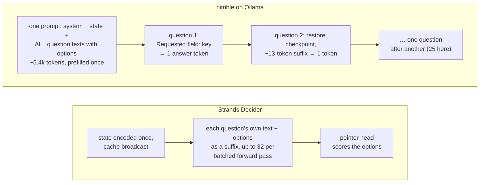

### How `/v1/systemone` is computed (Ollama, nimble)
This is read from the log. The prompt format is confirmed by nimble's source.
1. **One prompt holds everything shared:** a template preamble, then `state`, then the text of **every** question with its options.
   - That's ~5,446 tokens here, growing with total question text: ~5,000 + 66 per word for our question set.
2. **Each question is then a short suffix,** 12–14 tokens: its key plus the turn switch.
   - The answer is **one constrained token** (`logit-bias` sampler; one-letter codes A–Z).
   - Option probabilities come from a softmax over that token's logits for the codes.
3. **The shared part is prefilled once,** in a separate prefill task.
   - That task's prompt is the shared part plus the first ~4 tokens of question 1's suffix. Its one generated token is counted in usage (`output_tokens` = questions + 1) but answers nothing.
   - A context checkpoint is saved at the end of the **whole shared part: preamble, state and every question's text**.
4. **The questions are answered one after another,** not in parallel.
   - All tasks run on one slot. Each restores the 50 MB checkpoint, processes its suffix and reads the answer.
   - At ~16 ms per token, these tiny suffixes are ~8× less efficient than the bulk prefill (~2 ms per token).
5. **Nothing carries over between different queries.**
   - The query comes right after the 86-token preamble, so different queries share only 86 tokens with any earlier prompt.
   - Ollama does keep a RAM cache of earlier prompts (up to ~8 GB) and resumes from the best match. That helps only when a prompt repeats an earlier one beyond the preamble: the same query again, or a query starting with the same words.
   - nimble's hybrid/recurrent memory can only be restored from checkpoints, not cut back to an arbitrary prefix.
   - The reported `input_tokens` (~130k) charges every question the full prompt. The actual compute is one ~5.4k prefill plus 25 short suffixes.

### What is in each question's suffix (Ollama, nimble)
*Suffix* is the question's prompt length minus the 5,446-token shared part. *Shared with previous* is the number of suffix tokens in common with the previous question's suffix (from `checking sim = …`).

| Question(s) | Suffix tokens | Shared with previous |
|---|---|---|
| `cat_seating` (first) | 13 | 4 (with the prefill task) |
| `cat_tables`, `cat_beds`, `cat_mattresses`, `cat_storage`, `cat_desks` | 12 / 13 / 14 / 12 / 13 | 1 each |
| `filter_color` (first filter) | 12 | **0** |
| other `filter_*` | 12–14 | 1, but **2** for `filter_leg_material` → `filter_leg_color` |
| `word_1` (first word) | 13 | **0** |
| `word_2` … `word_7` | 13 each | **2** each |

- **Facts from the log:** consecutive suffixes share exactly as many leading tokens as the question keys share leading parts, and the longest keys have the longest suffixes. So each suffix starts with the question key.
- **Confirmed by nimble's `prepare_prompts`** (`nimble/scoring/parallel_schema.py`):
  - The user message is `safe_json({"context": context, "schema": fields}) + "\n\nRequested field: " + safe_json(name)`. `fields` is the **whole schema**, with lettered choices.
  - The chat template is applied with `enable_thinking=False`.
  - The shared prefix is the common token prefix of all the per-field prompts.
  - **So the model reads all questions once, and for each answer is told only "Requested field: `<key>`".** The key is the question's only per-question cue.
- **Not verified:**
  - Ollama's own wrapping.
  - The exact ~9-token turn switch.
  - Whether the prefill is exactly +4 tokens on purpose, which makes llama.cpp's end-minus-4 checkpoint land on the shared boundary. The open checks are listed in `backlog.md`.
- **Consequences:**
  - A question's own text affects only the shared prefill, not its per-question cost (~0.18 s).
  - Keys matter for accuracy: `word_1`…`word_7` differ only by a digit, so self-describing keys are worth trying.
  - Every question is answered with all the others in context.

### Batched scoring: nimble's `ParallelScorer` vs Ollama
- **What `ParallelScorer` does:** nimble's MLX scorer prefills the same shared prompt once. It then copies that cache across a batch (`broadcast_cache` → `mx.broadcast_to`) and scores all fields' suffixes in **one batched forward pass**.
- **What Ollama does:** it prefills once too, but answers the fields one at a time. Its System One implementation is sequential by design (PR #18606) and has no batching setting.
- **Measured on this M3 Max** (server-side timings, the same 25-question request, median of 3 queries):

| Backend / mode | Wall | Prefill | Field evaluation |
|---|---|---|---|
| Ollama (llama.cpp, questions sequential) | 15.6 s (p50 over 1,000 queries) | ~10.8 s (5.4k tokens) | ~4.6 s (25 × ~0.18 s) |
| MLX `parallel`, all 25 fields in one batch | 17.5 s | 12.7 s (6.5k tokens) | 3.4 s (one run spiked to 11.6 s; peak 16.9 GiB) |
| MLX `parallel`, field batch size 1 | 16.4 s | 12.4 s | 2.8 s |
| MLX `cached_serial` (one prefill, then fields one at a time) | 16.4 s | 11.7 s | 2.9 s |

- **On the 100 dev queries,** MLX takes 17.6 s per query vs Ollama's 16.2 s.
  - Scoring is ~1.4 s faster on MLX.
  - But nimble's own rendering is ~1k tokens longer (6.4k vs 5.4k; it adds a letter code to every option), and that costs ~2.3 s more prefill.
- **Batching gains little at this prompt length.** Each batched branch has to copy the long attention cache, so all fields cost ~3 s whether batched or not.
  - nimble's reported 7× speed-up is against re-prefilling the prompt for every field, which Ollama already avoids.
  - All modes return identical answers. The eval runs used `cached_serial`.
- **nimble was trained on prompts of up to 2,048 tokens.** Ours are ~5.4k (the checkpoint supports 8,192), which may also cost accuracy.

### What would reduce latency (nimble)
- **Prefill (~2/3 of the time)** scales with the **total text of all questions.**
  - Fewer or shorter questions cut it proportionally. Examples: shorter option descriptions; a two-stage request (category first, then only the filters that apply); dropping per-word questions, which saves ~0.3 s per word.
- **Two server-side changes would be needed for a big speed-up:**
  - Questions rendered *before* the state, so the static ~5k tokens become a reusable prefix.
  - Question suffixes evaluated as one batch.
- **`OLLAMA_NUM_PARALLEL`** raises throughput across concurrent queries, not the latency of one query.

## Usage
### Makefile
`make` (or `make help`) lists every workflow. Settings are variables: `BACKEND`, `MODEL`, `SCHEME`, `SPLIT`, `LIMIT`, `OVERWRITE`, `Q`, `V`.
```bash
make doctor                                           # what this machine has; which runs can be re-run (with fixes)
make runs                                             # status of every run: stored dev/eval predictions, decoding settings
make parse Q="blue velvet sofa for my mom"            # one query (default: nimble on Ollama, embedded scheme)
make dev   BACKEND=ollaya MODEL=jeb:4b                # 100 dev queries for a run (resumable), plus its table
make tune  BACKEND=ollaya MODEL=jeb:4b                # tune that run's decoding on dev -> results/tuned_settings.json
make eval  BACKEND=ollaya MODEL=jeb:4b                # 1,000 eval queries (resumes; OVERWRITE=1 re-runs from scratch)
make report BACKEND=ollama MODEL=tev1 SPLIT=eval      # detailed report: per-attribute scores, confusions, worst queries
make bench BACKEND=ollama MODEL=tev1                  # clean latency on 30 dev queries (nothing else running)
make results                                          # rebuild tables, mcnemar files and per-run reports from stored predictions (runs: src/sidm/runs.py)
make mcnemar SPLIT=eval [METRIC=full] [SIG=1]         # print the pairwise McNemar tests readably
make data                                             # generate / resume the dataset (needs qwen3:14b)
make status                                           # what's loaded in Ollama / Ollaya / MLX, and free disk
make ollama-pull | ollama-rm | ollama-unload | mlx-convert | mlx-serve | mlx-stop | ollaya-serve | ollaya-pull | ollaya-rm | ollaya-stop
```
- **Errors explain themselves:** a missing server, model or key prints `error:` and `fix:` lines, e.g. `fix: make ollama-pull MODEL=tev1`.
- **Re-decoding needs no model:** predictions store the raw answers, so `report`, `tune` and `results` re-decode them with the current code.
- **One model at a time:** don't run dataset generation and a GPU eval together; only one model on the GPU.

### Command line (`sidm`)
```bash
uv run sidm "cheap grey oak coffee table with storage"   # category, filters, residual, latency
uv run sidm -v   "..."   # + per-word roles with probabilities, top category candidates, each filter's probability and kept/dropped reason
uv run sidm -vv  "..."   # + top-3 options of every question, token usage
uv run sidm -vvv "..."   # + raw request and response JSON
uv run sidm --json "..." # decoded result as JSON
uv run sidm --untuned "..."                      # plain argmax decoding
uv run sidm --scheme router "..."                # the other category scheme
uv run sidm --backend ollaya --model jeb:4b "..."   # any backend / model
```

### Underlying commands
```bash
uv run python -m sidm.gen_dataset --n 1100 --out data/eval_raw.jsonl --workers 2                 # dataset (resumable)
uv run python -m sidm.results_table --runs embedded@ollama:tev1 --run --split dev                # run/resume + table
uv run python -m sidm.evaluate tune --apply --pred results/dev_tev1_embedded.jsonl               # per-model tuning
uv run python -m sidm.evaluate report --pred results/eval_tev1_embedded.jsonl --md results/report_eval_tev1_embedded.md
scripts/make_results.sh                                                                           # all result tables
```

## Layout
- **`src/sidm/`**, a Python 3.9 package with no dependencies beyond the standard library:
  - `schema.py`: ontology, attributes, residual vocabulary and consistency checks.
  - `gen_dataset.py`: synthetic dataset generation and validation.
  - `parser.py`: request building, category schemes, decoding and per-model tuned settings.
  - `ollama_client.py`: the backends, retries and automatic request splitting.
  - `evaluate.py`: `run`, `report`, `tune`, `compare`, and the prediction file paths (`pred_path`).
  - `results_table.py`: the results tables (Markdown + JSON) and McNemar tests.
  - `runs.py`: the registry of the study's runs (`EVAL_RUNS`, `DEV_RUNS`) and their status (`make runs`).
  - `doctor.py`: the machine check (`make doctor`).
  - `cli.py`: the `sidm` command.
  - `example_doc.py`: builds `docs/example_request.md`.
  - `figures.py`: the README figures (`make figures`; needs matplotlib from the `figures` uv dependency group).
  - `preview.py`: the readable dataset dump.
- **`mlx_backend/`**, a separate Python 3.12 project:
  - `convert_model.py`: reusable adapter → MLX conversion.
  - `server.py`: `/v1/systemone` over `ParallelScorer`.
  - `serve.sh`: starts the server.
- **`scripts/`:** `make_results.sh` (all tables and McNemar files, from the presets in `runs.py`) and `ollaya_serve.sh`.
- **`Makefile`:** the typical workflows.
- **`data/`:**
  - `eval_raw.jsonl`: the dataset.
  - `schema.json`: the schema as JSON.
  - `REVIEW.md`: the manual review.
  - `preview.txt`: the readable dump.
- **`results/`:**
  - `results_{eval,dev}.{md,json}`: the main tables.
  - `mcnemar_{eval,dev}.txt`: readable pairwise significance tests.
  - `<split>_<label>_<scheme>.jsonl`: per-query predictions.
  - `tuned_settings.json`: per-model decoding settings.
  - `report_eval_<run>.md`: detailed per-run eval reports.
  - `bench/`: latency benchmarks.
  - Run logs and the helper scripts used for the long runs.
- **`.env.example`:** template for `.env` (API keys, server URLs); `.env` itself is git-ignored.
- **`docs/example_request.md`:** a real request and response.
- **`docs/figures/`:** the README figures (SVG, regenerated by `make figures`).
- **`backlog.md`:** findings and next experiments.
- **`CLAUDE.md`:** notes for coding agents.
